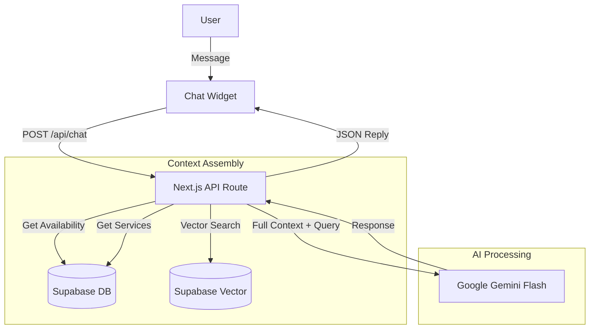

# Sothis Therapeutic Massage - Next.js Booking Platform with AI Receptionist

**Sothis** is a modern, high-performance web application designed for a therapeutic massage business. It streamlines the client experience through an intuitive booking system, bilingual support (English/Spanish), and a sophisticated **AI Receptionist named Nancy**.

This project serves as a comprehensive case study in building full-stack applications with **Next.js 15**, **Supabase**, and **Generative AI**.


## 🚀 Key Features

-   **🤖 AI Receptionist ("Nancy")**: A RAG-powered chatbot that answers inquiries about services, pricing, and availability in real-time.
-   **📅 Smart Booking System**: Custom calendar interface for clients to book available slots, integrated with admin-defined schedules.
-   **🌍 Bilingual Support**: Fully localized in English and Spanish using `next-intl`.
-   **🛡️ Admin Dashboard**: Secure area for managing bookings, setting availability, and viewing client history.
-   **⚡ High Performance**: Built with React Server Components, Tailwind CSS v4, and edge-ready API routes.

---

## 💡 Case Study: "Chat with Nancy" (AI Receptionist)

The standout feature of this platform is **Nancy**, an AI agent designed to handle the repetitive task of answering client questions. Unlike standard chatbots, Nancy has real-time awareness of the business's schedule and services.

### How It Works (Architecture)

1.  **User Query**: The user asks a question via the floating chat widget (e.g., *"Do you have openings this Friday?"*).
2.  **RAG Context Injection**:
    -   **Static Knowledge**: We generate embeddings for business policies and FAQs using `text-embedding-004` and store them in **Supabase Vector**. We perform a similarity search to retrieve relevant documents.
    -   **Dynamic Context**: The system fetches *live* data from the database, including the current service list (with prices) and upcoming available slots for the next 7 days.
3.  **Prompt Assembly**: A rich system prompt is constructed, combining the user's role ("Receptionist"), the retrieved static knowledge, and the live dynamic context.
4.  **Generation**: The assembled prompt is sent to **Google Gemini Flash**, which generates a natural, helpful response in the user's detected language.
5.  **Response**: The answer is streamed back to the UI with a typing effect.

### Technical Implementation

-   **Frontend**: Built with `framer-motion` for smooth entrance animations and a polished chat interface. The widget state is managed locally but persists conversations during the session.
-   **Backend**: A Next.js API route (`/api/chat`) orchestrates the RAG pipeline.
    -   *Embedding Model*: `text-embedding-004`
    -   *Generative Model*: `gemini-flash-latest`
    -   *Database*: Supabase (PostgreSQL + pgvector)



---

## 🏗️ System Architecture

### Technology Stack

-   **Framework**: [Next.js 15](https://nextjs.org/) (App Directory)
-   **Language**: TypeScript
-   **Styling**: [Tailwind CSS v4](https://tailwindcss.com/)
-   **Database & Auth**: [Supabase](https://supabase.com/)
-   **AI**: [Google Generative AI SDK](https://ai.google.dev/)
-   **Animation**: [Framer Motion](https://www.framer.com/motion/)
-   **Internationalization**: [`next-intl`](https://next-intl-docs.vercel.app/)
-   **Icons**: [Heroicons](https://heroicons.com/)

### Project Structure

-   `src/app`: App Router pages and API routes.
-   `src/components`: Reusable UI components (buttons, modals, chat widget).
-   `src/lib`: Core logic (Supabase client, Gemini AI wrapper, context providers).
-   `src/messages`: JSON translation files for EN/ES.

---

## 🛡️ Reliability & Monitoring

To ensuring the AI features remain active despite model deprecations or API changes, we implemented a proactive monitoring system:

-   **Health Check Endpoint**: `/api/health/ai` performs a live generation test with the configured Gemini model.
-   **Automated Daily Checks**: A GitHub Action workflow (`.github/workflows/ai-health-check.yml`) pings this endpoint every day.
-   **Configurable Models**: Model names are decoupled from code and managed via environment variables (`GEMINI_EMBEDDING_MODEL`, `GEMINI_CHAT_MODEL`), allowing for instant hot-swapping without deployment.

## 🛠️ Getting Started

### Prerequisites

-   Node.js (v18+)
-   Supabase Project
-   Google AI Studio API Key

### Installation

1.  **Clone the repository**:
    ```bash
    git clone https://github.com/yourusername/sothis.git
    cd sothis
    ```

2.  **Install dependencies**:
    ```bash
    npm install
    ```

3.  **Configure Environment**:
    Create a `.env.local` file with the following:
    ```env
    NEXT_PUBLIC_SUPABASE_URL=your_supabase_url
    NEXT_PUBLIC_SUPABASE_ANON_KEY=your_supabase_key
    GEMINI_API_KEY=your_gemini_api_key
    # Optional: Customize models (Defaults shown)
    GEMINI_EMBEDDING_MODEL=models/gemini-embedding-001
    GEMINI_CHAT_MODEL=gemini-flash-latest
    ```

    > **Note for Vercel Deployment**: Remember to add these environment variables in your Vercel project settings.

4.  **Run Development Server**:
    ```bash
    npm run dev
    ```

    Open [http://localhost:3000](http://localhost:3000) to view the application.
    -   **Test Chat**: Click the floating button.
    -   **Test Health Check**: Visit `/api/health/ai`.
