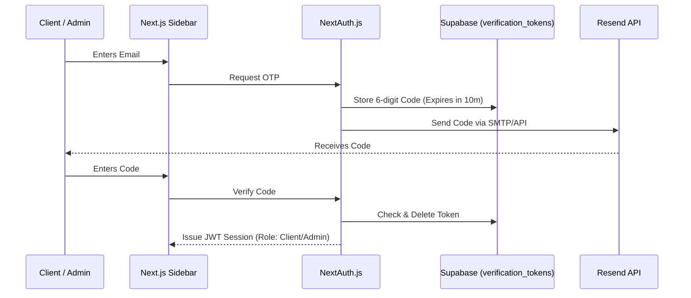
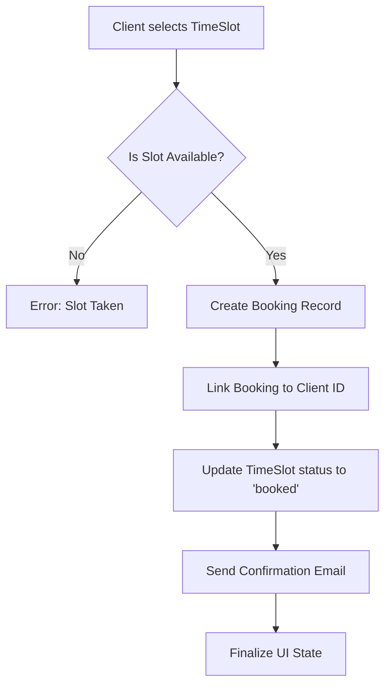

# Technical Architecture & Data Flow: Sothis Therapeutic Massage

This document provides a comprehensive overview of the Sothis platform's technical architecture, focusing on **Authentication**, **Data Flow**, and **Information Management**. It is designed for client review and technical audit.

---

## 🔐 1. Authentication & User Lifecycle

Sothis utilizes a **Passwordless One-Time Password (OTP)** strategy powered by **NextAuth.js**. 

### **The Sign-In Journey (OTP Flow)**
Unlike traditional systems, we never store user passwords, which eliminates the risk of password leaks or credential stuffing attacks.

### **User Roles**
1.  **Client**: End-users who book appointments. Data is stored in the `clients` table.
2.  **Provider**: Therapists who manage schedules. Data is stored in the `users` table.
3.  **Admin**: Clinic owners who oversee the platform. Data is stored in the `users` table.

---

## 🔄 2. Core Data Flows

### **The Booking Lifecycle**
When a client books a session, the system ensures atomicity and consistency to prevent double-bookings.

---

## 🗄️ 3. Database Schema (PostgreSQL/Supabase)

Our data model is normalized to ensure high integrity and fast retrieval for Nancy's AI context.

| Table | Purpose | Key Fields |
| :--- | :--- | :--- |
| **`users`** | Internal staff & admins | `id`, `email`, `name`, `role` (admin/provider) |
| **`clients`** | Customer records (PII) | `id`, `email`, `name`, `phone`, `address` |
| **`bookings`** | Appointment details | `id`, `time_slot_id`, `client_id`, `service_type`, `status` |
| **`time_slots`** | Calendar availability | `id`, `date`, `start_time`, `end_time`, `status`, `provider_id` |
| **`services`** | Service catalog | `title`, `description`, `price`, `duration` |
| **`documents`** | AI Vector Knowledge | `content`, `metadata`, `embedding` (vector) |

---

## 🛡️ 4. User Information Management (PII & Privacy)

Data privacy is a core design principle of the Sothis platform. We implement two layers of isolation:

### **Layer 1: Database-Level Security**
- **Supabase RLS (Row Level Security)**: Ensures that a client can only see their own bookings.
- **Service Role Keys**: Sensitive administrative updates (like bulk syncing services) are performed server-side using restricted keys.

### **Layer 2: AI Isolation (The Nancy Privacy Guard)**
One of the most critical security features is the **RAG (Retrieval-Augmented Generation) Isolation**.

> [!IMPORTANT]
> **PII Protection**: Nancy (the AI Receptionist) **never searches the `clients` or `bookings` tables** during her semantic search (RAG) phase. 
> - Her "memory" is strictly limited to the `documents` table (blog posts, clinic FAQs, and the service catalog).
> - When a user asks about *their* specific booking, the system passes ONLY that specific record to the AI as context, rather than letting the AI "browse" all user data.

---

## 📈 5. Monitoring & Audit
- **Status Lifecycle**: Every booking follows a strict state machine: `confirmed` -> `completed` / `cancelled` / `no_show`.
- **System Logs**: All OTP requests and database updates are logged for security auditing.

---

> [!TIP]
> This architecture is highly scalable. Because the authentication is stateless (JWT) and the storage is handled by Supabase's global edge network, the platform remains fast even under heavy traffic.
